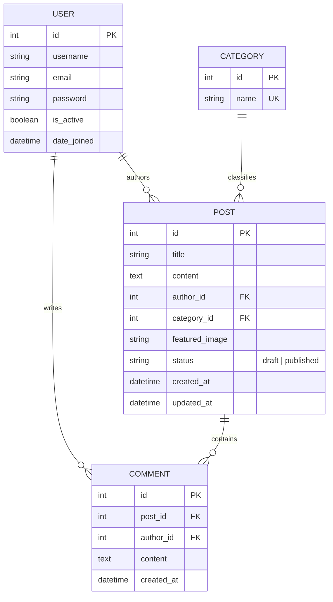

# TheBlog — Full-Stack Django Personal Blog Platform

A full-stack, multi-user personal blog platform built with Django. Users can register accounts, publish and draft blog posts, upload featured images, browse and filter posts by category/date, and manage their own content from a dedicated dashboard with full server-side permission enforcement.

---

## Table of Contents
- [TheBlog — Full-Stack Django Personal Blog Platform](#theblog--full-stack-django-personal-blog-platform)
  - [Table of Contents](#table-of-contents)
  - [Features](#features)
  - [Tech Stack](#tech-stack)
  - [Project Structure](#project-structure)
  - [Database Schema](#database-schema)
  - [Getting Started \& Installation](#getting-started--installation)
    - [1. Prerequisites](#1-prerequisites)
    - [2. Clone the Repository](#2-clone-the-repository)
    - [3. Create and Activate a Virtual Environment](#3-create-and-activate-a-virtual-environment)
    - [4. Install Dependencies](#4-install-dependencies)
  - [Environment Variables](#environment-variables)
  - [Running Migrations \& Server](#running-migrations--server)
    - [1. Apply Database Migrations](#1-apply-database-migrations)
    - [2. (Optional) Create an Admin Superuser](#2-optional-create-an-admin-superuser)
    - [3. Start the Development Server](#3-start-the-development-server)
  - [Running Automated Tests](#running-automated-tests)

---

## Features

- **User Authentication**:
  - Secure signup with password hashing (Django PBKDF2), validation against common/weak passwords, and duplicate username/email checks.
  - Auto-login upon registration.
  - Login and Logout session handling with contextual flash messages.
- **Post Management (CRUD)**:
  - **Create**: Authenticated users can write posts with titles, categories, content, and an optional featured image.
  - **Draft vs. Published**: Checkbox to publish immediately or save as a draft.
  - **Ownership Protection**: Posts are strictly associated with their author server-side; unauthorized editing or deletion is blocked.
- **Featured Image Upload (Bonus Feature)**:
  - Supports image uploads via Django's `ImageField` and Pillow.
  - Media files served securely during development.
  - Featured images rendered responsively on the feed list.
- **Feed & Exploration**:
  - Real-time search by post title.
  - Category filtering and sorting (newest/oldest).
  - Server-side pagination (6 posts per page).
- **Personal Dashboard**:
  - Dedicated "My posts" management table displaying post statuses (Published vs. Draft), categories, update timestamps, and action buttons.

---

## Tech Stack

- **Backend**: Python 3.10+, Django 6.1.1
- **Database**: SQLite3 (development) / PostgreSQL compatible
- **Image Processing**: Pillow 12.3.0
- **Configuration**: Python-dotenv (12-factor app environment configuration)
- **Frontend**: Django Templates, Semantic HTML5, Custom CSS3 (Flexbox, Grid, CSS Variables)
- **Testing**: Django `TestCase` and `Client`

---

## Project Structure

```text
blog-website/
├── .venv/                      # Python virtual environment
├── blog_platform/              # Django project root
│   ├── manage.py               # Django administrative CLI
│   ├── requirements.txt        # Pinned project dependencies
│   ├── .env                    # Local environment secrets (git-ignored)
│   ├── .env.example            # Template for environment variables
│   ├── db.sqlite3              # Local SQLite database
│   │
│   ├── config/                 # Project configuration package
│   │   ├── __init__.py
│   │   ├── settings.py         # App configuration, security, media & static settings
│   │   ├── urls.py             # Root URL dispatcher & media route configuration
│   │   ├── wsgi.py             # WSGI entry point for web servers
│   │   └── asgi.py             # ASGI entry point for async servers
│   │
│   ├── blog/                   # Core blog application
│   │   ├── __init__.py
│   │   ├── admin.py            # Django admin interface definitions
│   │   ├── apps.py             # Application configuration
│   │   ├── forms.py            # Form validation (RegisterForm, PostForm)
│   │   ├── models.py           # Database models (Category, Post, Comment)
│   │   ├── urls.py             # Application URL routes and endpoints
│   │   ├── views.py            # Business logic and request handlers
│   │   ├── tests.py            # Comprehensive automated test suite
│   │   └── migrations/         # Database migration files
│   │       ├── __init__.py
│   │       └── 0001_initial.py # Schema migrations for Category, Post, Comment
│   │
│   ├── templates/              # Global Django HTML templates
│   │   ├── base.html           # Master layout with responsive navbar, drawer & alerts
│   │   ├── register.html       # User signup page
│   │   ├── login.html          # User login page
│   │   ├── post_list.html      # Public feed with search, category filters & pagination
│   │   ├── post_create.html    # Post editor form with file upload
│   │   └── dashboard.html      # User post management table
│   │
│   ├── static/                 # Static assets
│   │   └── css/
│   │       └── styles.css      # Consolidated, responsive design system
│   │
│   └── media/                  # User-uploaded files (git-ignored)
│       └── post_images/        # Uploaded featured images
└── README.md                   # Project documentation
```

---

## Database Schema



---

## Getting Started & Installation

### 1. Prerequisites
- **Python 3.10** or higher
- **pip** (Python package installer)
- **Git**

### 2. Clone the Repository
```bash
git clone <repo-url>
cd blog-website/blog_platform
```

### 3. Create and Activate a Virtual Environment
```bash
# On macOS / Linux:
python3 -m venv ../.venv
source ../.venv/bin/activate

# On Windows:
python -m venv ..\.venv
..\.venv\Scripts\activate
```

### 4. Install Dependencies
```bash
pip install -r requirements.txt
```

---

## Environment Variables

Copy `.env.example` to create your local `.env` file:
```bash
cp .env.example .env
```

Ensure your `.env` contains the necessary configurations:
```ini
SECRET_KEY=django-insecure-your-development-secret-key
DEBUG=True
ALLOWED_HOSTS=127.0.0.1,localhost
```

---

## Running Migrations & Server

### 1. Apply Database Migrations
Run the migrations to set up the SQLite database:
```bash
python manage.py migrate
```

### 2. (Optional) Create an Admin Superuser
To access the Django Admin interface at `/admin/`:
```bash
python manage.py createsuperuser
```

### 3. Start the Development Server
```bash
python manage.py runserver
```

Open your browser and visit:
```text
http://127.0.0.1:8000/
```

---

## Running Automated Tests

The application includes an extensive test suite verifying:
- Form validation (case-insensitive username & email uniqueness, password strength and similarity checks)
- User registration and auto-login workflows
- Server-side permission guards (`@login_required`)
- Post creation, drafts vs. published status
- Featured image upload (in-memory image generation and file cleanup)
- Feed rendering with featured image URLs

To execute all tests, run:
```bash
python manage.py test blog
```
